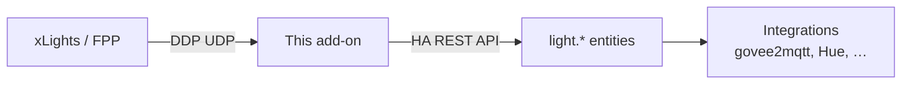

# xLights DDP Entity Bridge

[](https://github.com/alexbbt/ha-xlights-ddp-bridge/actions/workflows/ci.yml)
[](LICENSE)

Home Assistant **Supervisor add-on** that receives [DDP](https://www.3wayplc.com/ddp-by-3way/) from **xLights** or **Falcon Player (FPP)**, maps each RGB pixel to a `light.*` entity, and pushes updates at a low, configurable rate.

Built for smart lights that cannot keep up with full show frame rates—Govee (via govee2mqtt), Hue, Wi‑Fi bulbs, and similar integrations.

## Who it's for

- Holiday / permanent lighting setups sequenced in xLights or FPP
- Home Assistant users who want show control of ordinary RGB lights (not WLED controllers)
- Anyone who needs DDP → HA with throttling so cloud/LAN lights are not flooded

## Architecture



```
xLights / FPP  --DDP UDP-->  add-on  --HA API-->  light entities  -->  integrations
```

Each configured `entity_id` is one RGB pixel. Channel count in xLights/FPP should be `3 × number of lights`.

## Install (Supervisor)

1. **Settings → Add-ons → Add-on store → ⋮ → Repositories**
2. Add:

   ```
   https://github.com/alexbbt/ha-xlights-ddp-bridge
   ```

3. Install **xLights DDP Entity Bridge**
4. Start the add-on, then either:
   - **Open Web UI** (Ingress) to pick and reorder lights, or
   - **Configuration** tab to edit `lights` as text (both stay in sync)
5. In xLights or FPP, point the controller at your Home Assistant host IP (`HOMEASSISTANT_IP`), protocol **DDP**, channels = `3 ×` light count

Default UDP port: **4048**. Allow that port from your show network to Home Assistant if you use VLANs or firewalls.

## Open Web UI (Ingress)

Supervisor’s Configuration tab cannot host Home Assistant entity pickers, so this add-on also provides an Ingress page:

- Ordered light picker (search, add/remove, reorder = DDP pixel order)
- Live status: HA health, DDP listen address, last xLights/FPP peer, packets/sec, payload size check, per-pixel color swatches
- Tests: HA connection check, pulse white / all off
- Recent events ring buffer (full logs remain on the add-on **Log** tab)

Saving lights/`hz` from Ingress writes the same options as the Configuration tab and hot-reloads the bridge. Changing `ddp_port` / `ddp_bind` still needs an add-on restart.

## Configuration

| Option | Default | Meaning |
|--------|---------|---------|
| `hz` | `5` | Max updates per second to Home Assistant |
| `ddp_port` | `4048` | UDP listen port |
| `ddp_bind` | `0.0.0.0` | Bind address |
| `lights` | example placeholders | Ordered list of `entity_id`s; pixel 0 → first entry |

Behavior:

- `rgb(0,0,0)` → `light.turn_off`
- Any other color → `light.turn_on` with `rgb_color` and `brightness` (max of R/G/B)
- Unchanged colors are skipped (no redundant API calls)

Example options (replace with your entities):

```yaml
hz: 5
ddp_port: 4048
ddp_bind: "0.0.0.0"
lights:
  - entity_id: light.example_pixel_1
  - entity_id: light.example_pixel_2
```

### Example: Govee segments via govee2mqtt

Govee (and similar) devices are **not** DDP targets. DDP goes to this add-on; your integration talks to the device.

```yaml
hz: 5
ddp_port: 4048
ddp_bind: "0.0.0.0"
lights:
  - entity_id: light.govee_segment_001
  - entity_id: light.govee_segment_002
  - entity_id: light.govee_segment_003
  - entity_id: light.govee_segment_004
```

Any Home Assistant light that accepts `rgb_color` works. Non-RGB lights may ignore color.

## xLights / FPP setup

1. Add an Ethernet / network controller:
   - Protocol: **DDP**
   - IP: `HOMEASSISTANT_IP` (your Home Assistant host)
   - Channels: `3 ×` number of configured lights
2. Create a model (e.g. Single Line with N nodes) on that controller
3. Prefer slow color changes over high-speed twinkles or chases on Wi‑Fi/cloud lights
4. Ensure the show network can reach HA UDP port **4048** (or your `ddp_port`)

## Troubleshooting

| Symptom | Things to check |
|---------|-----------------|
| Nothing happens | Add-on logs show `Listening DDP…`. Test from xLights Output, or use the smoke script below. |
| HA API errors | Add-on has `homeassistant_api: true` and Core is up before the add-on starts. |
| Works locally, not from FPP | Firewall/VLAN: UDP from the player to `HOMEASSISTANT_IP:4048` must be allowed. |
| Lights lag or drop | Lower `hz` (try `2`–`5`). Avoid effects that change every frame. |
| Wrong light mapping | `lights` order is pixel order; pixel 0 is the first `entity_id`. |

## Local development / test

No add-on install required. Use a long-lived access token from your Home Assistant profile.

```bash
cd xlights_ddp_bridge
export HA_URL=http://HOMEASSISTANT_IP:8123
export HA_TOKEN=YOUR_LONG_LIVED_TOKEN
export HZ=5
export DDP_PORT=4048
export LIGHTS_JSON='["light.example_pixel_1","light.example_pixel_2"]'
PYTHONPATH=. python3 -m bridge
```

In another terminal, send a test DDP packet:

```bash
cd xlights_ddp_bridge
PYTHONPATH=. python3 -m tests.smoke_ddp --host 127.0.0.1 --port 4048
```

Unit tests (no Home Assistant required):

```bash
cd xlights_ddp_bridge
PYTHONPATH=. python3 -m unittest discover -s tests -v
```

## Releases

Pushes to `main` that pass CI automatically bump the add-on version, tag `vX.Y.Z`, and publish a [GitHub Release](https://github.com/alexbbt/ha-xlights-ddp-bridge/releases).

- Default bump: **patch**
- Commit message contains `[minor]` or starts with `feat:` → **minor**
- Commit message contains `[major]` or `BREAKING CHANGE` → **major**
- `[skip release]` in the commit message skips publishing

After a release, use **Check for updates** on the add-on in Supervisor (it tracks `config.yaml` `version` on `main`).

## Contributing

See [CONTRIBUTING.md](CONTRIBUTING.md). Please follow the [Code of Conduct](CODE_OF_CONDUCT.md).

Security reports: [SECURITY.md](SECURITY.md).

## License

[MIT](LICENSE) © Alexander Bell-Towne
